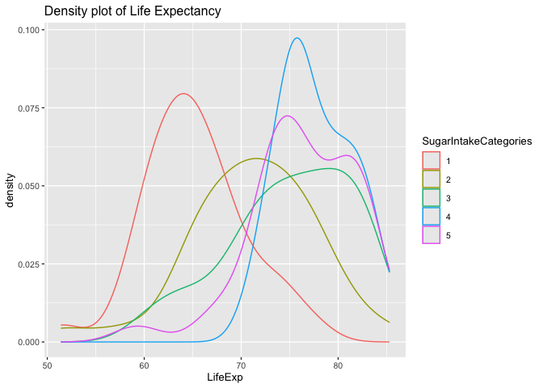
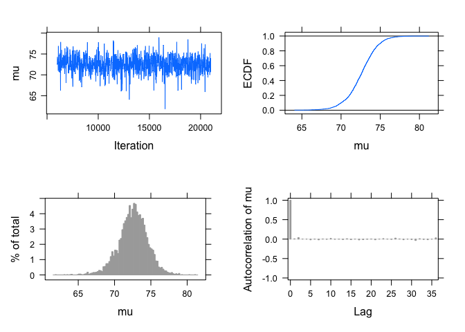
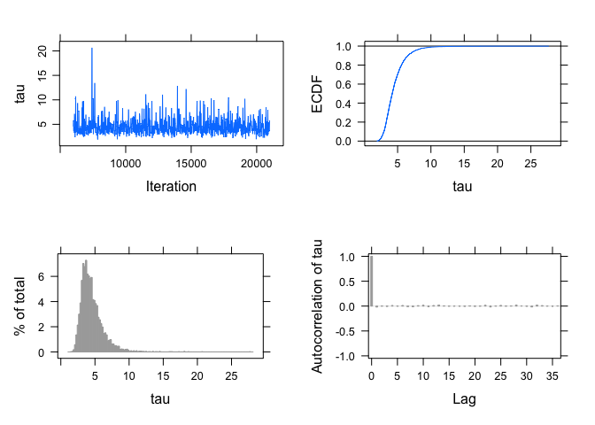
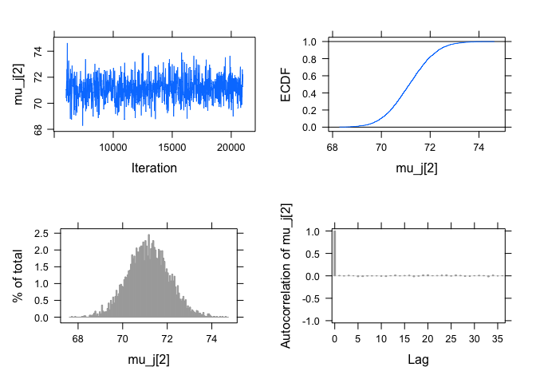
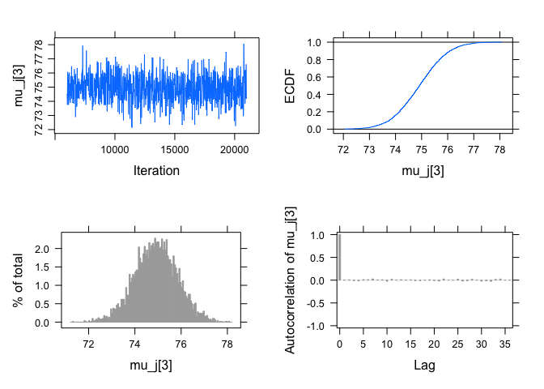
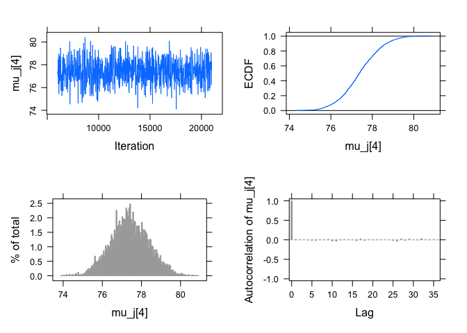
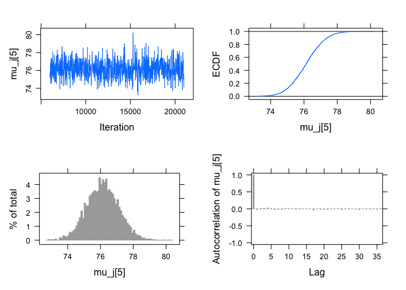
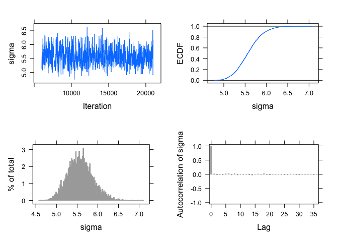
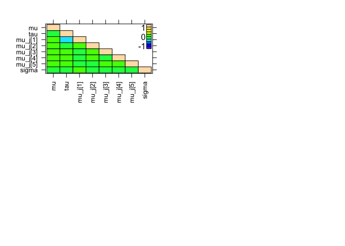

The relationship between sugar intake and life expectancy
================
Eriola Hajro

``` r
# keep only the year 2018 for Sugar Intake
SugarIntake2018 <- na.omit(select(SugarIntake, "country", "X2018"))
summary(SugarIntake2018)
```

    ##    country              X2018         
    ##  Length:172         Min.   :  0.0274  
    ##  Class :character   1st Qu.: 59.4250  
    ##  Mode  :character   Median : 99.3500  
    ##                     Mean   :106.0573  
    ##                     3rd Qu.:140.5000  
    ##                     Max.   :446.0000

``` r
# sugar intake data -> divide into five categories based on quantiles with category 1 representing the lowest 20% of sugar intake and cat. 5 representing the highest 20%
thresholds <- quantile(SugarIntake2018$X2018, probs = seq(0, 1, by = 0.2))
SugarIntakeCategories <- cut(SugarIntake2018$X2018, breaks = thresholds, labels = FALSE)
SugarIntake2018 <- cbind(SugarIntake2018, SugarIntakeCategories)
```

``` r
# keep only the life expectancy data for 2018
LifeExpectancy2018 <- na.omit(select(LifeExpectancy, "country", "X2018"))
summary(LifeExpectancy2018)
```

    ##    country              X2018      
    ##  Length:196         Min.   :51.40  
    ##  Class :character   1st Qu.:67.00  
    ##  Mode  :character   Median :73.55  
    ##                     Mean   :72.69  
    ##                     3rd Qu.:77.92  
    ##                     Max.   :85.30

``` r
# create a new dataset by merging the Sugar Intake and the Life Expectancy datasets for year 2018
# merge by common variable "country"
LifeExpectancyBySugarIntake <- merge(LifeExpectancy2018, SugarIntake2018, by="country", suffixes = c("LifeExpectancy", "SugarIntake"))
# only keep the columns for Life Expectancy in year 2018 and the Sugar Intake Categories in our dataset
LifeExpectancyBySugarIntake <- LifeExpectancyBySugarIntake[, c("X2018LifeExpectancy", "SugarIntakeCategories")]
LifeExpectancyBySugarIntake <- na.omit(LifeExpectancyBySugarIntake)
# change the name of variable "X2018LifeExpectancy" to "LifeExp"
names(LifeExpectancyBySugarIntake)[names(LifeExpectancyBySugarIntake) == "X2018LifeExpectancy"] <- "LifeExp"
LifeExpectancyBySugarIntake$SugarIntakeCategories = as.factor(LifeExpectancyBySugarIntake$SugarIntakeCategories)
```

The dataset that will be used for this hierarchical model is
LifeExpectancyBySugarIntake.

**A plot that shows the distribution of the life expectancy variable
accross the 5 sugar intake categories that have been created**

``` r
ggplot(LifeExpectancyBySugarIntake, aes(LifeExp, color = SugarIntakeCategories)) +
  geom_density() + labs(title = "Density plot of Life Expectancy") + 
  theme_grey(base_size = 10, base_family = "") 
```

<!-- -->

``` r
# calculate the mean life expectancy for each sugar intake category
tapply(LifeExpectancyBySugarIntake$LifeExp, LifeExpectancyBySugarIntake$SugarIntakeCategories, mean)
```

    ##        1        2        3        4        5 
    ## 65.17059 71.07353 75.04857 77.68438 76.34848

``` r
# calculate the standard deviation of life expectancy for each sugar intake category
tapply(LifeExpectancyBySugarIntake$LifeExp, LifeExpectancyBySugarIntake$SugarIntakeCategories, sd)
```

    ##        1        2        3        4        5 
    ## 5.247079 6.607998 6.333263 3.763416 5.366570

- Sampling distribution

$$
Y_1,...,Y_n \text{ | } \mu_j, \sigma \sim \text{Normal}(\mu_j, \sigma)
$$

- Prior

$$
\mu_j \text{ | } \mu, \tau \overset{\text{i.i.d}}{\sim}
\text{Normal}(\mu, \tau)
$$ $$
1/\sigma^2 \text{ | } \alpha_{\sigma}, \beta_{\sigma} \sim \text{Gamma} (1, 1)
$$

- Hyperpriors

$$
\mu \text{ | } \mu_0, \gamma_0 \sim \text{Normal}(70, 5)
$$

$$
1/\tau_2 \text{ | } \alpha_{\tau}, \beta_{\tau} \sim \text{Gamma} (1, 1)
$$

## JAGS Script for the Hierarchical Model

``` r
modelString <-"
model {
## likelihood
for (i in 1:N){
y[i] ~ dnorm(mu_j[category[i]], invsigma2)
}

## priors
for (j in 1:J){
mu_j[j] ~ dnorm(mu, invtau2)
}
invsigma2 ~ dgamma(a_g, b_g)
sigma <- sqrt(pow(invsigma2, -1))

## hyperpriors
mu ~ dnorm(mu0, 1/g0^2)
invtau2 ~ dgamma(a_t, b_t)
tau <- sqrt(pow(invtau2, -1))
}
"
```

- Pass the data and hyperparameter values to JAGS:

``` r
y = LifeExpectancyBySugarIntake$LifeExp   
category = LifeExpectancyBySugarIntake$SugarIntakeCategories 
N = length(y)  
J = length(unique(category)) 

initsfunction <- function(chain){
  .RNG.seed <- c(1,2)[chain]
  .RNG.name <- c("base::Super-Duper",
                 "base::Wichmann-Hill")[chain]
  return(list(.RNG.seed=.RNG.seed,
              .RNG.name=.RNG.name))
}

the_data <- list("y" = y, "category" = category, "N" = N, "J" = J, 
                 "mu0" = 70, "g0" = 5, 
                 "a_t" = 1, "b_t" = 1,
                 "a_g" = 1, "b_g" = 1)
```

- Run the JAGS code for this model:

``` r
posterior <- run.jags(modelString,
                      n.chains = 1,
                      data = the_data,
                      monitor = c("mu", "tau", "mu_j", "sigma"),
                      adapt = 1000,
                      burnin = 5000,
                      sample = 5000,
                      thin = 3, 
                      inits = initsfunction)
```

    ## Calling the simulation...
    ## Welcome to JAGS 4.3.2 (official binary) on Sun Mar  9 00:12:54 2025
    ## JAGS is free software and comes with ABSOLUTELY NO WARRANTY
    ## Loading module: basemod: ok
    ## Loading module: bugs: ok
    ## . . Reading data file data.txt
    ## . Compiling model graph
    ##    Resolving undeclared variables
    ##    Allocating nodes
    ## Graph information:
    ##    Observed stochastic nodes: 168
    ##    Unobserved stochastic nodes: 8
    ##    Total graph size: 361
    ## . Reading parameter file inits1.txt
    ## . Initializing model
    ## . Adaptation skipped: model is not in adaptive mode.
    ## . Updating 5000
    ## -------------------------------------------------| 5000
    ## ************************************************** 100%
    ## . . . . . Updating 15000
    ## -------------------------------------------------| 15000
    ## ************************************************** 100%
    ## . . . . Updating 0
    ## . Deleting model
    ## . 
    ## Note: the model did not require adaptation
    ## Simulation complete.  Reading coda files...
    ## Coda files loaded successfully
    ## Calculating summary statistics...
    ## Finished running the simulation

## JAGS Output of the Hierarchical Model

- Obtain posterior summaries of all parameters:

``` r
summary(posterior) 
```

    ##          Lower95    Median  Upper95      Mean        SD Mode       MCerr MC%ofSD SSeff
    ## mu      68.50130 72.632350 76.40230 72.555920 2.0002526   NA 0.029702136     1.5  4535
    ## tau      2.08544  4.195585  7.67465  4.547665 1.6880588   NA 0.023399732     1.4  5204
    ## mu_j[1] 63.49860 65.576100 67.39280 65.581521 0.9705438   NA 0.013169034     1.4  5432
    ## mu_j[2] 69.31950 71.152550 72.95660 71.156748 0.9315981   NA 0.013174787     1.4  5000
    ## mu_j[3] 73.01290 74.917650 76.64800 74.913169 0.9253939   NA 0.013087046     1.4  5000
    ## mu_j[4] 75.54940 77.374900 79.40740 77.396591 0.9857713   NA 0.013940911     1.4  5000
    ## mu_j[5] 74.28060 76.128650 78.07910 76.135250 0.9743404   NA 0.014390956     1.5  4584
    ## sigma    4.99317  5.563370  6.20390  5.577100 0.3099827   NA 0.004383817     1.4  5000
    ##                 AC.30 psrf
    ## mu       0.0182576241   NA
    ## tau      0.0167017934   NA
    ## mu_j[1] -0.0014508596   NA
    ## mu_j[2] -0.0095857681   NA
    ## mu_j[3] -0.0239954799   NA
    ## mu_j[4] -0.0279568806   NA
    ## mu_j[5]  0.0128663194   NA
    ## sigma   -0.0005806394   NA

- Diagnostic plots

``` r
par(mfrow = c(3, 3))
plot(posterior, vars = c("mu_j[1]", "mu_j[2]","mu_j[3]","mu_j[4]","mu_j[5]","mu",
                         "tau","sigma"))
```

    ## Generating plots...

<!-- --><!-- --><!-- --><!-- --><!-- --><!-- --><!-- --><!-- --><!-- -->

- To compute the posterior means:

``` r
Posterior_Means <- summary(posterior)[, 4]
Means <- data.frame(Mean = Posterior_Means[3:(4 + J - 2)])
Means$Title <- c("Sugar Intake Category 1 (Min-20th percentile)", "Sugar Intake Category 2 (20th-40th percentile)", "Sugar Intake Category 3 (40th-60th percentile)",
                  "Sugar Intake Category 4 (60th-80th percentile)", "Sugar Intake Category 5 (80th percentile-Max)")
Means
```

    ##             Mean                                          Title
    ## mu_j[1] 65.58152  Sugar Intake Category 1 (Min-20th percentile)
    ## mu_j[2] 71.15675 Sugar Intake Category 2 (20th-40th percentile)
    ## mu_j[3] 74.91317 Sugar Intake Category 3 (40th-60th percentile)
    ## mu_j[4] 77.39659 Sugar Intake Category 4 (60th-80th percentile)
    ## mu_j[5] 76.13525  Sugar Intake Category 5 (80th percentile-Max)

- 90% credible intervals for the means

``` r
Credible_intervals <- summary(posterior)[, c(1,3)]
Intervals <- data.frame(Interval = Credible_intervals[3:(4 + J - 2),])
Intervals$Title <- c("Sugar Intake Category 1 (Min-20th percentile)", "Sugar Intake Category 2 (20th-40th percentile)", "Sugar Intake Category 3 (40th-60th percentile)",
                  "Sugar Intake Category 4 (60th-80th percentile)", "Sugar Intake Category 5 (80th percentile-Max)")
Intervals
```

    ##         Interval.Lower95 Interval.Upper95                                          Title
    ## mu_j[1]          63.4986          67.3928  Sugar Intake Category 1 (Min-20th percentile)
    ## mu_j[2]          69.3195          72.9566 Sugar Intake Category 2 (20th-40th percentile)
    ## mu_j[3]          73.0129          76.6480 Sugar Intake Category 3 (40th-60th percentile)
    ## mu_j[4]          75.5494          79.4074 Sugar Intake Category 4 (60th-80th percentile)
    ## mu_j[5]          74.2806          78.0791  Sugar Intake Category 5 (80th percentile-Max)

- The posterior samples of the mean parameter for each sugar intake
  category, convert to mcmc object

``` r
Category1mean_draws <- as.mcmc(posterior, vars = "mu_j[1]")
Category2mean_draws <- as.mcmc(posterior, vars = "mu_j[2]")
Category3mean_draws <- as.mcmc(posterior, vars = "mu_j[3]")
Category4mean_draws <- as.mcmc(posterior, vars = "mu_j[4]")
Category5mean_draws <- as.mcmc(posterior, vars = "mu_j[5]")
```

- The posterior probability that the mean life expectancy for Sugar
  Intake category 1 is lower than that of category 2

``` r
mean(Category1mean_draws < Category2mean_draws)
```

    ## [1] 1

- The posterior probability that the mean life expectancy for Sugar
  Intake category 2 is lower than that of category 3

``` r
mean(Category2mean_draws < Category3mean_draws)
```

    ## [1] 0.9982

- The posterior probability that the mean life expectancy for Sugar
  Intake category 3 is lower than that of category 4

``` r
mean(Category3mean_draws < Category4mean_draws)
```

    ## [1] 0.9688

- The posterior probability that the mean life expectancy for Sugar
  Intake category 4 is lower than that of category 5

``` r
mean(Category4mean_draws < Category5mean_draws)
```

    ## [1] 0.1734

- The posterior probability that the mean life expectancy for Sugar
  Intake category 1 is lower than that of category 5

``` r
mean(Category1mean_draws < Category5mean_draws)
```

    ## [1] 1

- Posterior distribution of ratio (the proportion of total variance
  explained by group-level variance)

``` r
tau_draws <- as.mcmc(posterior, vars = "tau")
sigma_draws <- as.mcmc(posterior, vars = "sigma")
R <- tau_draws^2/(tau_draws^2 + sigma_draws^2)

df <- as.data.frame(R)

quantile(R, c(0.025, 0.975))
```

    ##      2.5%     97.5% 
    ## 0.1556442 0.7110114
